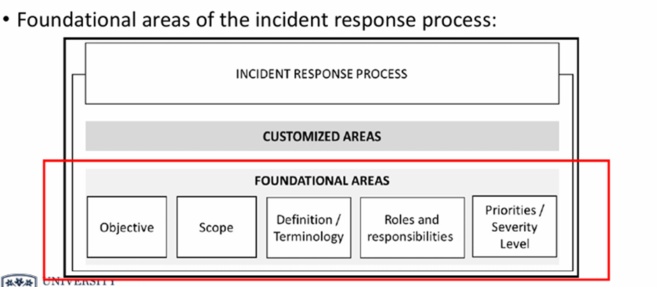
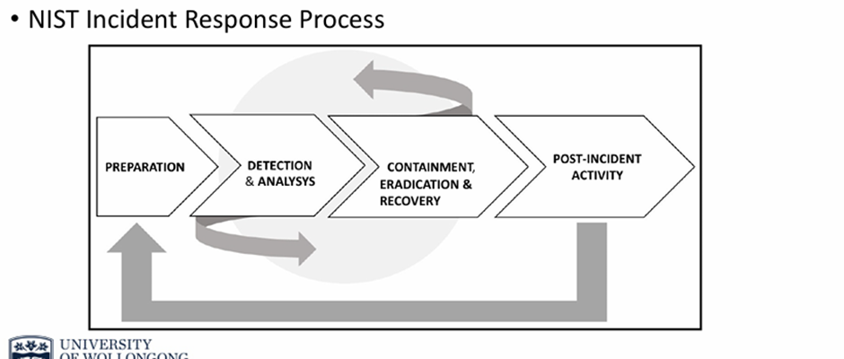

Chp 1-2
--------------------------------------------------------------------------------------------------------------
## IR process is defined by detection and response
Detection: how to handle security incidents

Response: how to rapidly respond to them
 
At point 7, IR process will
-	Take over incidence case
-	Doc every single step of the process
-	Incorporates the lessons learned with the aim of enhancing overall sec pos after incident is resolved

Process will vary by company, industry segment and standard

Without IR process, there will be Bad security posture and waste of human resources

Creating successful IR process
-	All IT personnel should be trained to know how to handle security incident
-	All Users should be trained to know core fund about sec
-	Integration between help desk system and incident response team
-	Good sensors (IDS) in places such as Network + Host sensors for quick and comprehensive detection
-	IR process must be compliant with laws and industry regulations

 
Objective: purpose of this process
-	Important to define clearly purpose of process
-	Everyone should be aware of what this process is trying to accomplish

Scope: whom does this process apply
-	Company wide scope vs departmental scope

Define/Terminology: each company has different perception of sec incident
-	Define what constitutes a sec incident and give examples
-	Create their own glossary using clearly defined terminology

Roles and responsibilities: who has authority
-	Define the users or groups that have this level of authority
-	Let entire company be aware of this

Priorities/Severity level: functional impact of incident in the business
-	Type of info affected by the incident
-	Recoverability
Interaction with 3rd parties, partners and customers is needed to be defined

Preparation
-	Implementation of sec controls that were created based on initial risk assessment
-	Implementation of other sec controls such as endpoint protection, malware protection and network sec
-	Preparation phase is not static and will receive input from post-incident activity

Detection & analysis
-	Detection system must be aware of attack vectors
-	System must dynamically learn about new threats and behaviours
-	System triggers alert if suspicious activity is encountered
-	To detect threats more quickly and reduce false positives, leveraging sec intelligence and advanced analytics are required
-	Detection and analysis are sometimes done almost in parallel: Attack is still taking place when detected
-	Manual info gather is required to identify incident which is done in compliance with company’s policy
-	To bring data into court of law, need to guarantee data’s integrity
-	Combo and correlation of following info to identify IoC are required
  -	Endpoint protection and OS logs: phishing email, lateral movement
  -	Server logs and network captures: unauthorized or malicious process
  -	Firewall logs and network capture: data extraction and submission

Containment
-	Perform short-term containment by isolating portion of network that is under threat. Afterwards, focus on long-term containment which requires temp adjustment to allow system to be used in production while rebuilding clean systems
-	This also restores affected systems in min time

Eradication
-	Remove malware from all infected devices, acknowledge root cause of attack and take necessary steps to avoid similar attacks in the future
Recovery
-	To avoid further attacks, put affected production systems back online
-	To ensure norm operation, test, check and track affected systems

Post-Incident Activity
-	Documenting lesson learned
  -	One of the most valuable pieces of info that you have in the post-incident activity phase
  -	Helps to keep refining process through identification of gaps in the current process and areas of improvement
  -	Documentation must be very detailed with full timeline of incident
  -	Content: steps were taken to resolve problem, what happened during each step and how issue was resolved outlined in depth
-	Lesson learnt will include answers of the following
  -	Who identified the sec issue === user or detection system
  -	Was incident opened with right priority
  -	Did sec ops team perform initial assessment correctly
  -	Was data analysis done correctly
  -	Were containment, eradication and recovery done correctly
  -	Anything that could be improved at this point
  -	How long did it take to resolve this incident
-	Evidence retention
  -	All artifacts should be stored according to company’s retention policy
  -	Evidence must be kept intact until legal actions are completely settled

IR cloud update
-	Preparation
  -	Needs to update contact list to include cloud provider contact info, on-call process, etc
-	Detection
  -	Include cloud provider solution for detection in order to assist during investigation
-	Containment
  -	Revisit cloud provider capabilities to isolate an incident (eg. Isolate compromised VM for others)

6 phases of threat life cycle management
Forensic Data Collection
-	Threats come through 7 domains of IT. The more of the infrastructure the org can see, the more threats it can detect.
  -	7 domains include: User domain, workstation domain, LAN domain, LAN-to-WAN domain, remote access domain, WAN domain and System/Application domain
-	Collection of security event and alarm data
-	Collection of log and machine data
-	Collection of forensic sensor data
Discovery phase
-	Search analytics
  -	Carrying out software-aided analytics
  -	Review reports and identify any known or reported exceptions from network and antivirus security tools
  -	Labour-intensive -> shouldn’t be sole analytics method
-	Machine analytics
  -	Purely done by machines/software
  -	Autonomously scan large amounts of data and give brief simplified results to people using ML
Qualification phase
-	Threats are assessed to find out
  -	Potential impact
  -	Urgency of resolution
  -	How to mitigate the threats
-	Inefficient qualification may lead to true positives being missed and false positives being included
-	False pos are big challenge -> waste of resources against non-existent threats
Investigation phase
-	Qualified threats are fully investigated to determine whether or not they have caused a sec incident
-	Threat might have done in the org before it was identified by sec tools -> need to look at any potential damage
-	Continuous access to forensic data and intelligence about a large amount of threats is required. (mostly automated)
Neutralization phase
-	Eliminate or reduce impact of identified threat
-	Automated process to ensure higher throughput of deleting threats and to ease info sharing and collab in the org
Recovery phase
-	Comes after all threats are neutralized and risks are put under control
-	Org to position is restored prior to being attacked by threats
  -	Changes caused by attacker or for recover are needed to be backtracked
-	Automated recovery tools can be used to return sys to backed-up state
-	Ensure no backdoors are introduced or left behind

Cybersecurity kill chain
Attackers operates on well-structured and scheduled plans for intrusion to remain undetected
The 5 steps
-	External reconnaissance (info gathering)
  -	Attacker harvest as much info as possible to find vulns
  -	Decides on exploitation techniques that are suitable for each vuln
    -	They gather info outside the target’s network and system
    -	Includes target’s supply chain, obsolete device disposal and employee’s social media activities
    -	Anyone in org can be targeted including suppliers and customers
  -	Social engineering attacks such as phishing is used to get entry point of the org network
  -	Phishing is usually linked to malware installation and claims to be from reputable institutions
    -	Other types of social engineering attacks: closely follow targets and collect info (happens through social media)
-	Compromising the system
  -	Once either of these or another technique is used, attacker will find point of entrance through stolen passwords or malware infection
  -	Stolen pw will give attacker direct access to pc, servers or devices within internal network of org
  -	Malware can be used to infect even more pc or server which brings them under the command of the hacker
-	Lateral movement
  -	This phase involves use of various scanning tools to find loopholes that can be exploited to stage an attack
  -	Pop scanning tools (framework): Metasploit and Kali Linux
  -	(network): Wireshark, Nmap, Aircrack-ng, Kismet, OWASP Zap
    -	Wireshark: Hackers and pen testers capture data packets in network
    -	Nmap: network mapping tool
    -	Aircrack-ng: suite of tools for wireless hacking. (FMS, KoreK and PTW)
-	FMS: attack keys that have been encrypted using RC4
-	KoreK: attack wifi networks that are secured with WEP encrypted pw
-	PTW: hack through WEP and WPA secured wifi networks
    -   Kismet: wireless network sniffer and IDS
    -	OWASP Zap: website vuln scanner that hackers use to identify any exploitable loopholes in org websites
  -	Pw cracking tools: John the Ripper, THC Hydra and Cain & Abel -> supports brute or dictionary attacks on pw
-	Privilege escalation
  -	Vertical priv esc is where attacker moves from one acc to another that has higher level of auth and tools are used to esc priv
    -	Attacker gets access rights and priv of high level auth such as admin/ super user
    -	Can run any unauth code (malware & ransomware) through priv it aquires
    -	Complex op and needs kernel-level op to elevate access right
    -	Buffer overflow used for vert priv esc
    -	EternalBlue is a vuln used for WannaCry
  -	Horizontal priv esc is where the attacker uses the acc that has the same level of auth and that acc is used to esc priv
    -	Attacker uses same priv gained from initial access
    -	Normal user erroneously able to access protected resources using norm user acc
    -	Occurs when attacker is able to access protected resources using norm user acc
    -	Done through session and cookie theft, cross-site scripting, guessing weak pw and logging keystrokes
    -	Result: attacker has well-estb remote access entry points to target system, access to acc of sev user and knows how to avoid detection from sec tool
-	Concluding the mission
  -	Exfiltration
    -	Attacker extracts sensitive data which includes trade secrets, usernames, pw, personally identifiable data, top-secret doc and other types of data
    -	Attacker normally steals huge chunks of data in this stage
    -	Data would be put on sale for buyers
    -	Attacker could erase/modify files stored in compromised pc, systems and servers
  -	Sustainment
    -	Attacker may decide to remain silent even after extracting valuable data
    -	Malware are installed such as rootkit to ensure access to victim’s pc and system
    -	Sec tools are ineffective atp at detecting or stopping the attack from proceeding
    -	Attacker has multiple access points so access won’t be compromised if one point is closed
  -	Assault
    -	Perm dmg of data and sw, disable or alter functioning pc hw
    -	Egs. Stuxnet attack on Iranian nuclear facility
  -	Obfuscation
    -	Attacker covers their track using various techniques to confuse, deter or divert forensic investigation process.
    -	Hackers at times attack outdated servers in small businesses or public schools and then laterally move to attack other servers or targets. 
    -	Hackers also can use a free WiFi, which is generally not highly protected.
    -	Dynamic code obfuscation: This prevents detection from signature-based antivirus and firewall programs.
