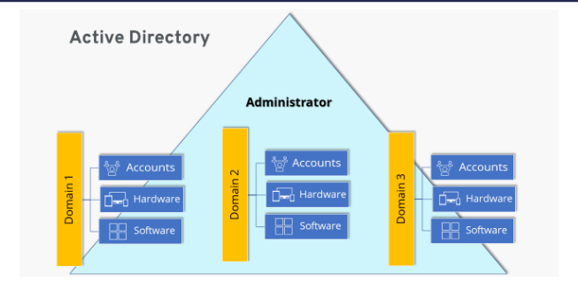

## Lateral movement
Attackers moving from device to device after initial intrusion in hopes of accessing high-valued data
- Also looks for ways to gain additional control of victim's netowrk
- Tries to not trigger alarms or raise any alerts

Attacks are carried out within org network, systems and premises
- Can take a long time, up to several months before hackers reach desired target device
- Involves scanning network for other resources, collecting and exploiting credentials or the collection of more info for exfiltration

## Sniffing tools
Free and open source utility for network discovery and security auditing

Wireshark, Tcpdump, Nmap and nessus are used

Nmap

Uses raw IP packets in novel ways to determine:
- Hosts available on network
- Services (application name and version) hosts are offering
- OS (and versions) they are running
- Type of packet filters/firewalls are used
- Dozens of other characteristics

Basic function of Nmap
- Basic command: `nmap <option> <target IPa>`

<option>
- TCP SYN scan (-sS)
- UDP scan (-sU)
- Scanning outputs will be open, closed, filtered, unfiltered or a combination

Timing options (-T)
- Paranoid (0)
- Sneaky (1)
- Polite (2)
- Normal (3)
- Aggressive (4)
- Insane (5)

Port specification
- Default is most common 1000 ports in random order
- Scans only defined ports (-p port range)
- Only 100 most common (-F)
- Don't randomize port numbers (-r)
- Scans most common N ports (--top-ports N)

Commands for script function would look like

`nmap --script <script name> <target url or ip>`

Auth: Used to test whether can bypass authentication mechanism

Broadcast: Used to find other hosts on the network and automatically add them to scanning queue

Brute: Used for brute password guessing

Discovery: Used to discover more about the network

Dos: Used to test whether a target is vuln to DoS

Exploit: Used to actively exploit a vuln

Fuzzer: Used to test how server responds to unexpected or randomized fields in packets and determine other potential vulns

Intrusive: Used to perform more intense scans that poses a much higher risk of being detected by admins

Malware: Used to test target for presence of malware

Safe: Used to perform general network security scan that's less likely to alarm remote admins

Vuln: Used to find vulnerabilities on the target

## NIDS vs HIDS
Network Intrusion Detection System (NIDSs)
- Shields their systems to prevent internal recon.
- Has limited capability when hackers are scanning individual targets

Host-based intrusion detection system
- Can prevent scan from happening
- Most network admins won't consider HIDS in a network especially if the number of hosts is huge

Once network admins detect there is a threat on the network, through sweep will be conducted and thwart progress made by attacker

Security tools can identify signatures of hacking tools and malwares

Legit tools can be used for lateral movement
- Security systems ignore them due to being legit
- Allows hackers to move around in highly secured networks

## Sysinternals
It is a suite of tools that allows admins to control windows-based pc from remote terminal

Attackers uses it to upload, execute and interact with executables on remote hosts.
- Can be automated using scripts

Doesn't give alerts to users on remote system during operation
- Classified as legit system admin tools and are ignored by antivirus programs
- Can be used to reveal info about running processes and kill or stop services

## Active directory

It is the richest source of info for the devices connected to a domain network
- Key target of an attack

AD stores names of useres alongside their roles in an org in the network and allows admins to change pw and privileges for them

## Privilege escalation
Act of exploiting bug, design flaw or config oversight in OS or sw app to gain elevated access to resources that are normally protected from app or user
- Attackers exploit these privileges to achieve
  - Mass deletion
  - Corruption
  - Theft of data
  - Disabling of pc
  - Destroying hw
  - etc

## Horizontal
Attacker uses normal acc to access account of other users
- Through sw bugs: user is able to view and access files of other users due to error in the coding of a system
- Through admin acc: attacker can go on with the attack by creating other admin level users

Horizontal attacks are normally facilitated by tools and techniques that steal login creds at the phase where hackers compromise a system

Attacker uses same privileges gained from initial access

Normally done through session and cookie theft, cross-site scripting, guessing weak pw and logging keystrokes

Result
- Attacker has well-established remote access entry points into target system
- Might have access to accounts of several users
- Knows how to avoid detection from security tools that target might have

## Vertical privilege escalation
Occurs when user/process is able to obtain higher level of access than admin or sys dev intended

More diff but more rewarding since attacker can acquire system rights on compromised system

Higher change of staying and performing actions on network system while remaining undetected
- With super user access rights, attacker can perform actions that admin can't stop or interfere with

Differs from system to system
- Windows: buffer overflows are commonly used
- Mac: done via jailbreaking
- Web-based tools: exploitation of backend code

Attacker should avoid alerts
- Otherswise, effort is for nothing
- Normal to disable security systems before escalating
- Or use legit tools to perform the attack

## Vertical escalation methods
Using valid admin acc
- Gains unauthorized access to admin and use to login to sensitive system or create own login creds
- Exploit programming errors which may introduce vulns that attackers can bypass security mechanisms
- Some systems will accept certain phrases as pw for all users

Access token manipulation
- Windows uses access tokens to determine owners
- OS logs in admin as normal users but executes their processes with admin privileges
  - If attacker can fool system with this, the processes will run without interferenece with full-level admin privileges
- If attackers cleverly copy access tokens from existing processes that are started by admin users in a machine to new window process (using built-in Windows API functions), access token manipulation can occur

Application shimmering
- Its a windows application compatibility framework
- Operation
  - Creates a shim to buffer between legacy program and OS
  - During execution of programs, shim cache is referenced to find out whether they will need to use the shim database
  - Shim db will use API to ensure program's codes are redirected effectively
  - Since shims are in direct communication with the OS, windows decides to add a safety feature where they are designed to run in user mode
- Attackers creates custom shims that bypasses user account control, inject DLL into running processes and meddle with memory addresses
- These shims enables attackers to run their own malicious programs with elevated privileges.
  - Can also be used to turn off security sw (windows defender)

Attacks using DLL
- DLL (Dynamic-Link Library) is a shared library
  - Allows devs to share code and data without requiring apps to be re-linked or re-joined
  - In Apple based OS, Dylib is used instead
- DLL injection
  - Used to run malicious code using legit processes and services of Win OS
  - This also mask's the attacker's action
  - The aim is to modify the windows registry, create threads and do DLL loading which requires admin privileges

Sequence
- Attaching malicious code -> Access memory -> Copy malicious DLL to memory -> Execute with legitimate processes

Reflective DLL injection
- Loads the malicious code without having to make the usual Windows API calls
- This bypasses DLL loading monitoring by sourcing its malicious code in the form of raw data
- Hard to detect even on machines that are adequately protected by security sw

Examples
- Backdoor.Oldrea: injects itself in the explore.exe process
- BlackEnergy: injects as DLL into the svchost.exe process
- Duqu: injects itself in many processes to avoid detection

DLL search order hijacking
- Attackers try to replace legit DLL with malicious ones
- Windows finds fake DLL first and loads it
- Modifying manifest/local direction files to force load a diff DLL

## Concluding the mission
Exfiltration
- Attacker starts extracting huge chunks of sensitive data from org
- Includes trade secrets, usernames, passwords, personally identifiable data, top-secret docs and other types of data
- Data is put on sale for any interested buyers
- Files on the compromised system can be erased or modified

Sustainment
- Hackers may decide to remain silent after exfiltration
- Malware is installed such as rootkit viruses to ensure access to victim's pc and systems
- Security tools are ineffective at detecting or stopping the attack from proceeding at this point
- Attacker normally has multiple access points to the victims such that even if one access point is closed, their access is not compromised

Assault
- Most feared stage as it permanently damages the data and sw, disabling or altering the functioning victim's hw
- Egs. Stuxnet attack on Iranian nuclear facility
  - First recorded digital weapon to be used to wreak havoc on physical resources
  - Transmitted by USB thumb drive

## Stuxnet and Flame
Stuxnet attacks a target system in three phases
- First by targeting windows pc and network by replicating itself repeatedly
- Next, it seeks out Siemens Step7 software that is used to program industrial control systems that operate equipment
- Finally, it compromises the programmable logic controllers

### Stuxnet steps
1. Infection
2. Search
3. Update
4. Compromise
5. Control
6. Deceive and Destroy

### Flame
Precursor to Stuxnet and is a spohisticated worm
- Data sent off in smaller chunks
- Can exchange data with any bluetooth enabled device