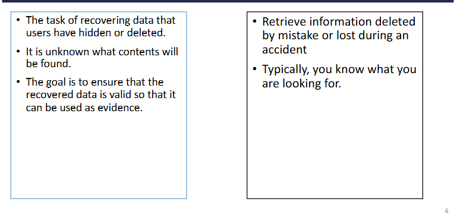
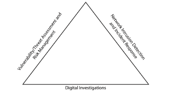

## Digital forensics
Forensics science is the application of scientific methods to collect, preserve and analyse evidence related to legal cases

Digital forensics is the application of computer science and investigative procedures for a legal purpose involving the analysis of digital evidence

In NIST 800-86
- Digital forensics is the application of science to the identification, collection, examination and analysis of data while preserving the integrity of the information and maintaining a strict chain of custody for the data

Investigating digital devices includes:
- Collecting data securely
- Examining suspect data to determine details such as origin and content
- Presenting digital information to courts
- Applying laws to digital device practice

Forensic tools and techniques are also useful for tasks such as:
- Operational troubleshooting
- Log monitoring
- Data recovery
- Data acquisition
- Due diligence/ regulatory compliance

Data Forensics vs Data Recovery

Forensics is about legal validity and chain of custody while Recovery is about getting data back regardless of legal use

## Investigations Triad for Computer Security
Forensics investigators often work as part of a team to secure orgs pc and network

The triad is made up of the following functions
1. Vuln/Threat assessment and risk management
  - Test and verify integrity of stand-alone workstations and network servers which covers the physical security of systems and security of OS and applications
  - Conduct authorized penetration test for vulns
2. Network intrusion detection and incident response
  - Detect intruder attacks and response to the attack
  - Collect evidence for litigation against intruders
3. Digital investigations
  - Manage investigations and conduct forensics analysis of systems suspected of containing evidence related to an incident or a crime

## History of Digital Forensics
Simple forensics tools such as Xtree Gold (mid-1980) recognised file types and retrieved lost/deleted files

Later on, Nortion DiskEdit became the preferred tool for recovering deleted files

IACIS introduced training software for digital forensics exam, IRS created search-warrant programs.

ASR Data Expert Witness became the first commercial GUI software for Macintosh

More tools emerged such as ILook (IRS Criminal Investigation Division) and AcessData FTK (popular in law enforcement & civilian market)

## Successful Digital forsensics investigator
Develop and maintain contact with computing, network and investigative professionals

Join computer user groups in both public and private sectors
  - Computer Technology Investigators Network (CTIN) meets to discuss problems with digital forensics examiners encounter

Consulting outside experts when needed

Extras:
1. Maintain professional conduct: ethics, morals, standards of behaviour; maintaining objectivity and confidentiality
2. Stay current: atend training on latest changes in hardware, software, networking and forensics tools
3. Always be prepared: have a contingency plan including alt software, hardware and investigative approaches

## Business measures to reduce litigation risk
Publishing and maintaining policies that employees can find easy to read and follow

Displaying warning barriers which informs end users that the organization reserves the right to inspect computer systems and network traffic at will
  - Can be used to show the line of authority for an investigation which can
    - show the user's expectation of privacy
    - avoid the issue of authority to inspect

On the internal warning banners depending on the type of org
  - Access to this system and network is restricted
  - Use of this system and network is for official business only
  - Systems and networks are subject to monitoring at any time by the owner
  - etc

Business are advised to specify an authorized requester who has the power to initiate investigation such as 
  - Corporate security investigations
  - Corporate ethics office
  - Corporate equal employment opportunity office
  - Internal auditing
  - General counsel or legal department

Three situations common in private-sector
1. Abuse or misues of computing assets
2. E-mail abuse
3. Internet abuse

Addressing the issue of personal devices accessing the company network
  - BYOD is a major challenge in company security, digital investigations and compliance with regulations including company policies

## Securing evidence 
The 4 phases of preparation
1. Taking a systematic approach
2. Accessing the cae
3. Planning the investigation
4. Securing the evidence

### First phase
The first phase can apply standard system analysis steps which includes
  - Making an initial assessment about the type of case you're investigating
  - Determining a prelim design or approach to the case
  - Creating a detailed checklist
  - Determining the resources you need
  - Obtaining and copying the evidence drive
  - Identifying the risks
  - Mitigating or minimizing the risks
  - Testing the design
  - Analyzing and recovering the digital evidence
  - Completing the case report
  - Critiqing the case

### Second phase
The second phase should take into consideration of the following aspects
  - Nature of the case
  - Type of evidence available
  - Location of evidence

### Third phase
The third phase begins with a basic investigation plan which should include
  - Aqcuiring the evidence
  - Completing an evidence form and establishing a chain of custody
  - Transporting the evidence to a computer forensics lab
  - Securing evidence in an approved secure container
  - Preparing forensics workstation
  - Retrieve the evidence from the secure container
  - Make a forensic copy of the evidence
  - Return the evidence to the secure container
  - Process the copied evidence with computer forensics tools

The evidence custody form should contain
  - Case number
  - Investigating organization
  - Investigator
  - Nature of case
  - Location evidence was obtained
  - Description of evidence
  - Vendor name
  - Model number or serial number
  - Evidence recovered by (name)
  - Date and time
  - Evidence placed in locker
  - Item #/Evidence processed by /Dispotion of evidence/Date/Time
  - Page number

### Fourth phase
Use evidence bags to secure and catalog evidence

Use computer safe products when collecting computer evidence
  - Antistatic bags
  - Antistatic pads

Use well padded containers

Use evidence tape to seal all openings
  - CD drive bays
  - Insertion slots for power supply electrical cords and USB cables

Write initials on tape to prove that evidence hsa not yet been tampered with

Consider computer specific temperature and humidity ranges
  - Ensure safe environment for transporting and storing it until a secure evidence container is available

