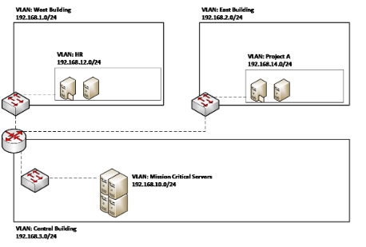
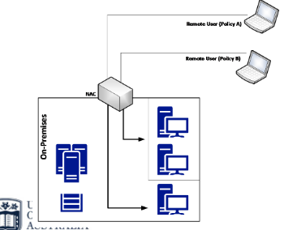
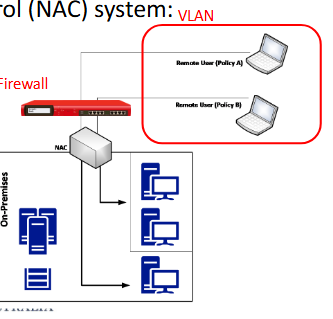

# CSIT302 Cybersecurity – Network Segmentation Notes

---

## Defence-in-Depth Approach

A layered security strategy that ensures multiple layers of protection exist, each with its own security controls. Sensors in each layer alert administrators to suspicious activity. 

The purpose is to break the attack kill chain before an attack is fully executed.

### Three Sections of Implementation

Infrastructure and Services
- Attackers can target an organisation's infrastructure and services
- All services must be enumerated to identify possible attack vectors:
  - Identify which assets the organisation has
  - Specify potential attackers and possible attack techniques
- Add security controls (e.g. patch management, server protection, network isolation, backups)
- Two forms of infrastructure: On-premises and IaaS (Infrastructure as a Service)
- In hybrid environments (on-premises + IaaS), threat modelling and implementation of security controls must be considered if the org is leveraging their services using IaaS
- Goal: reduce vulnerability count and severity, reduce exposure time and increase difficulty and cost of exploitation

Documents in Transit
- "Documents" refers to any type of data
- Data is most vulnerable when moving between locations
- When in transit, it must be protected by encryption whether in public or internal networks
- Additional controls include Activity Monitoring, Access Control, and Data Protection (layered around data)
- The entire end-to-end communication path must be considered to identify threats and ways to mitigate them

Endpoints
- An endpoint is any device that can consume data — can be mobile or IoT devices
- Threat modelling must be performed to uncover all attack vectors and plan mitigation efforts accordingly
- Countermeasures include:
  - Separation of corporate and personal data/apps (isolation)
  - Use of TPM (Trusted Platform Module) hardware protection
  - OS hardening
  - Storage encryption

---

## Physical Network Segmentation

- Networks grow over time and security features are rarely revisited as expansion occurs
- The first step is understanding the logical distribution of resources according to company needs
- Establishing a physical network segmentation:
  - No data flows between physically segmented networks unless connected via a switch or router
  - Provides good isolation but has limitations:
    - Efficiency – a switch may have 24 ports but only 2 hosts per network
    - Scalability – one switch may not handle all hosts

---

## Virtual Local Area Network (VLAN)

VLANs are logically (not physically) separated networks on the same switch. VLAN 1 cannot communicate with VLAN 2 without a router.

### VLAN Based on Department (Small-to-Medium Organisations)
- Resources are grouped by department (Finance, HR, Operations, etc.)
- Isolates resources per department
- Advantage: Simple isolation per business unit
- Disadvantage (Limitation): Cross-VLAN access is needed when departments share common resources (e.g. a file server), requiring multiple rules, different access conditions, and higher maintenance — large networks typically avoid this approach

### VLAN Based on Other Aspects
- Business objectives – VLANs created where resources are based on common business objectives
- Level of sensitivity – VLANs based on risk level (high, medium, low), requires up-to-date risk assessment
- Location – organise resources by geographic location (suited to large organisations)
- Security zones – combined with other approaches for specific purposes (e.g. one zone for partner-accessed servers)

### Mixed VLAN Approach
- There is no single perfect solution for VLAN-based segmentation
- In practice, a mixed VLAN approach combines multiple criteria (location + department + sensitivity level)

- West Building VLAN (192.168.1.0/24) contains HR VLAN; Central Building VLAN contains Mission Critical Servers VLAN — all interconnected with controlled routing

### Best Practices for security of network segmentation
- Use SSH to manage switches and routers
- Restrict access to the management interface
- Disable unused ports
- Use security capabilities to prevent MAC flooding attacks
- Use port-level security (e.g. DHCP snooping)
- Keep switch and router firmware/OS up to date

---

## Network Access Control (NAC)

NAC is a security approach that unifies:
- Endpoint security technology (antivirus, host intrusion prevention, vulnerability assessment)
- User/system authentication
- Network security enforcement

Used when employees work remotely (from home or while travelling). NAC evaluates the remote system before granting access to the corporate network.

### Evaluation Criteria for Remote Systems
- Has the latest patches applied
- Antivirus is enabled
- Personal firewall is enabled
- Compliant with mandatory security policies

### NAC Scenarios
- Scenario 1: NAC validates the health state of a remote device and performs software-level segmentation — allowing the device to communicate only with predefined on-premises resources

- Scenario 2: All remote users are isolated in a dedicated VLAN, with a firewall between that VLAN and the corporate network — restricts the type of access remote users have

### Quarantine Network
- Computers that don't meet minimum requirements are placed in an isolated quarantine network
- The quarantine network provides remediation services that scan and fix the device before granting corporate network access

---

## Site-to-Site VPN

A VPN (Virtual Private Network) establishes a secure (encrypted) traffic channel between two remote sites. Commonly used by organisations with branch offices or remote locations.

- Typically uses IPSec protocol; some software VPNs use TLS
- IPSec: secure network protocol that authenticates and encrypts data packets for secure communication over IP networks
- Encryption is the default but not mandatory — in transport mode, traffic data is not encrypted

### Site-to-Site VPN Design
- Each branch office has specific firewall rules — the remote office only accesses certain segments of HQ, not the entire network
- The "need to know" principle should be enforced: only grant access to what is strictly necessary
  - Example: If the East Branch Office has no need to access the HR VLAN, that access should be blocked

---

## Virtual Network Segmentation

Security must be embedded even in virtual networks managed by a hypervisor (e.g. VirtualBox, VMware).

### Key Concepts
- Virtual networks are isolated within the virtual switch — traffic from one virtual network is not visible to another
- Each virtual network has its own subnet; VMs within it communicate freely but cannot traverse to other virtual networks
- For communication between virtual networks, a router with multiple virtual network adapters is required (can be a VM with routing enabled)
- Virtual extensions at the switch level allow packet inspection before forwarding — beneficial for overall security

### Virtual Switch Security Capabilities
- MAC address spoofing (ARP spoofing) prevention – blocks malicious traffic from spoofed MAC addresses
- DHCP guard – prevents VMs from acting as a DHCP server
- Router guard – prevents VMs from sending router advertisement/redirection messages
- Port ACL (Access Control List)** – configure specific access control based on MAC or IP addresses

---

## Case Study: Amazon AWS (Hybrid Cloud)

AWS provides security capabilities across infrastructure and network. Relevant to hybrid cloud environments (on-premises + cloud):

- **Network firewalls** built into Amazon VPC; **WAF (Web Application Firewall)** in AWS WAF for creating private networks and controlling access
- **Customer-controlled TLS encryption** in transit across all services
- **Private/dedicated connectivity** options from on-premises environments to AWS
- **Automatic encryption** of all traffic on AWS global and regional networks between AWS secured facilities

In a hybrid environment, organisations must apply threat modelling and security controls across both their on-premises infrastructure and their IaaS components.
