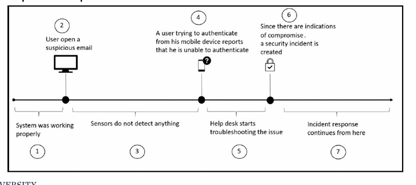

Chp 1-1
══════════════════════════════════════════════════════

## Goals of Cybersecurity

### Secrecy
- Effect of mechanisms used to limit number of principals who can access info
- Examples: cryptography and access control

### Confidentiality
- Obligation to protect person/org secrets if you know them

### Privacy
- Ability and/or right to protect personal info
- Extends to prevent invasions of personal space

> ⚠️ Caution: Privacy is secrecy for the benefit of the **individual**
> while Confidentiality is secrecy for the benefit of the **organisation**

---

## What is Security Posture

Solidifying protection system for org security isn't enough.
All three pillars must work together: **Detection | Protection | Response (DPR)**

### Detection
- Enhancing detection systems to quickly identify attacks

### Protection
- Implementing security controls to prevent breaches

### Response
- Enhancing effectiveness of response process
- Reduce time between infection and containment

---

## Threat Landscape
Continuously expanding as orgs allow working flexibility

### On-Premises
- Org uses its own physical infrastructure and servers within its own facilities
- Requires securing the internal network boundary directly

### Remote Access
- Using own infrastructure to access company's resources

### BYOD (Bring Your Own Device)
- Failures happen due to poor planning and network architecture
- Leads to insecure implementation

### Entry Points (based on connectivity)
1. Between On-premises and Cloud
2. Between BYOD devices and Cloud
3. Between On-premises and BYOD
4. Between Cloud and Personal devices

---

## Credentials

### Multi Factor Authentication (MFA)
- Uses multiple factors for authentication
- Example: ID/Password + One Time Password (OTP)
- OTP delivered through registered mobile number after initial authentication
- Other factors: biometric info (fingerprints, irises, face recognition)

### Continuous Monitoring
- New tech that uses a person's behaviour to continuously verify identity
- Verifies throughout a session, not just at entry point

### Security Considerations for Apps
- **In-house apps:** ensure apps use secure framework throughout SW dev lifecycle
- **Paid service apps:** check vendor security and compliance policy against company requirements

---

## Cybersecurity Challenges

### Top Causes of Breaches
1. Malware (viruses and trojans)
2. Lack of diligence and untrained employees
3. Phishing and social engineering
4. Targeted attack
5. Ransomware
6. Government-sponsored attack

### Causes 1, 2, 3 — Human Error
- May start with phishing email using social engineering
- Tricks employee to download virus, malware or trojan

### Cause 4 — Targeted Attack
- Attacker has specific target in mind
- Spends lots of time and resources on public reconnaissance
- Key attribute: **longevity** — maintains persistent access and moves laterally

### Cause 5 — Ransomware
- Companies failing to implement effective vulnerability management programs

### Cause 6 — Government-Sponsored Attack
- Intent to steal info to be used against another party
- Private sector shouldn't ignore these signs
- Orgs invest more into threat intelligence, ML and analytics

---

## Red and Blue Team

### Red Team
- Performs attacks and pen tests the environment against current security controls
- Composed of highly trained individuals with different skill sets
- Must be aware of current threat landscape and trends
- Must have coding skills to create and customize their own exploits

### Blue Team
- Ensures assets are secure
- If Red Team finds and exploits a vuln, Blue Team must rapidly remediate and document it

---

## Performance Metrics

### Red Team Metrics
| Metric | Description |
|--------|-------------|
| MTTC (Mean Time to Compromise) | From attack initiation to successful compromise |
| MTPE (Mean Time to Escalate) | From attack initiation to full admin privilege on target |

### Blue Team Metrics
| Metric | Description |
|--------|-------------|
| ETTD (Estimated Time to Detection) | Time taken to detect the attack |
| ETTR (Estimated Time to Recovery) | Time taken to recover from attack |

### Blue Team Response Steps
1. **Save evidence** — ensure tangible info to analyse and act on
2. **Validate the evidence** — catalogue valid attempts as Indication of Compromise (IoC)
3. **Engage necessary teams** — know what to do with IoC and who to inform
4. **Triage incident** — may involve law enforcement or warrants
5. **Scope the breach** — determine full extent of compromise
6. **Create remediation plan** — plan to isolate or evict adversary
7. **Execute and recover**

══════════════════════════════════════════════════════
Chp 1-2
══════════════════════════════════════════════════════

## Incident Response (IR) Process
- **Detection:** how to handle security incidents
- **Response:** how to rapidly respond to them

Most companies have an IR review but don't constantly review to incorporate lessons learned from previous incidents

At point 7, IR process will:
- Take over the incident case
- Document every single step of the process
- Incorporate lessons learned to enhance overall security posture

> ⚠️ Without IR process: Bad security posture + waste of human resources

### Creating a Successful IR Process
- All IT personnel trained to handle security incidents
- All users trained on core security fundamentals
- Integration between help desk system and incident response team
- Good sensors (IDS) at Network + Host level for quick detection
- IR process must comply with laws and industry regulations

---

## Fundamental Areas of IR Process

### Objective
- Clearly define the purpose of the process
- Everyone must be aware of what the process is trying to accomplish

### Scope
- Company-wide scope vs departmental scope

### Define/Terminology
- Define what constitutes a security incident with examples
- Create a glossary using clearly defined terminology

### Roles and Responsibilities
- Define users/groups with authority
- Make entire company aware

### Priorities/Severity Level
- Functional impact of incident on the business
- Type of info affected
- Recoverability
- Interaction with 3rd parties, partners and customers

---

## NIST Incident Response Lifecycle

### 1. Preparation
- Implement security controls based on initial risk assessment
- Implement endpoint protection, malware protection and network security
- Not static — receives input from post-incident activity

### 2. Detection & Analysis
- Detection system must be aware of attack vectors
- Dynamically learn about new threats and behaviours
- Triggers alert on suspicious activity
- Leverage security intelligence and advanced analytics to reduce false positives
- Detection and analysis sometimes run in parallel
- Manual info gathering required, in compliance with company policy
- Data integrity must be guaranteed to bring evidence to court
- Correlate the following to identify IoC:
  - Endpoint protection and OS logs → phishing email, lateral movement
  - Server logs and network captures → unauthorized or malicious process
  - Firewall logs and network capture → data extraction and submission

### 3. Containment
- **Short-term:** isolate portion of network under threat
- **Long-term:** temp adjustments to allow production use while rebuilding clean systems
- Restores affected systems in minimum time

### 4. Eradication
- Remove malware from all infected devices
- Acknowledge root cause and take steps to prevent similar attacks

### 5. Recovery
- Put affected production systems back online carefully
- Test, check and track affected systems to ensure normal operation

### 6. Post-Incident Activity
- **Lessons Learned** (most valuable output):
  - Full detailed timeline of incident
  - Steps taken, what happened, how it was resolved
  - Questions to answer:
    - Who identified the issue — user or detection system?
    - Was correct priority assigned?
    - Was initial assessment correct?
    - Was data analysis correct?
    - Were containment, eradication and recovery done correctly?
    - What could be improved?
    - How long did resolution take?
- **Evidence Retention:**
  - Store all artifacts per company retention policy
  - Keep evidence intact until legal actions fully settled

---

## IR Cloud Updates

| Phase | Update Required |
|-------|----------------|
| Preparation | Add cloud provider contact info and on-call process |
| Detection | Include cloud provider detection solutions |
| Containment | Use cloud provider capabilities to isolate incidents (e.g. isolate compromised VM) |

---

## 6 Phases of Threat Life Cycle Management

### Phase 1 — Forensic Data Collection
- Threats come through 7 IT domains:
  - User, Workstation, LAN, LAN-to-WAN, Remote Access, WAN, System/Application
- Collect: security event/alarm data, log/machine data, forensic sensor data

### Phase 2 — Discovery
- **Search analytics:** software-aided, reviews reports — labour intensive, not sole method
- **Machine analytics:** ML-based, autonomously scans large data, gives simplified results

### Phase 3 — Qualification
- Assess threats for: potential impact, urgency of resolution, mitigation approach
- Inefficient qualification → true positives missed, false positives included

### Phase 4 — Investigation
- Fully investigate qualified threats to determine if a security incident occurred
- Check for damage done before tools detected the threat
- Mostly automated, requires continuous forensic data access

### Phase 5 — Neutralization
- Eliminate or reduce impact of identified threat
- Automated to ensure higher throughput and easier collaboration

### Phase 6 — Recovery
- After threats neutralized and risks controlled
- Restore org to pre-attack position
- Backtrack changes made by attacker
- Use automated recovery tools to restore from backup
- Ensure no backdoors remain

---

## Cybersecurity Kill Chain (5 Steps)

### Step 1 — External Reconnaissance
- Harvest as much info as possible to find vulns
- Info gathered outside target's network:
  - Supply chain, obsolete device disposal, employee social media
- Social engineering (phishing) used to gain entry point
- Anyone in org can be targeted including suppliers and customers

### Step 2 — Compromising the System
- Entry gained through stolen passwords or malware infection
- Stolen pw → direct access to PCs, servers, devices
- Malware → infects more systems, brings them under hacker's command

### Step 3 — Lateral Movement
Scanning tools used to find exploitable loopholes:

| Category | Tools |
|----------|-------|
| Framework | Metasploit, Kali Linux |
| Network | Wireshark, Nmap, Aircrack-ng, Kismet, OWASP Zap |
| Password Cracking | John the Ripper, THC Hydra, Cain & Abel |

- **Aircrack-ng attacks:**
  - FMS: attacks RC4 encrypted keys
  - KoreK: attacks WEP encrypted WiFi
  - PTW: hacks WEP and WPA secured WiFi

### Step 4 — Privilege Escalation

#### Vertical Escalation
- Moves to account with higher auth level (admin/super user)
- Can run unauthorized code (malware & ransomware)
- Requires kernel-level operations
- Buffer overflow commonly used
- EternalBlue vuln used in WannaCry

#### Horizontal Escalation
- Uses same privilege level to access other users' accounts
- Methods: session/cookie theft, XSS, weak password guessing, keylogging
- Result: remote access entry points, access to multiple accounts, avoids detection

### Step 5 — Concluding the Mission

#### Exfiltration
- Extracts trade secrets, usernames, passwords, PII, top-secret docs
- Stolen data put up for sale
- Files on compromised systems can be erased or modified

#### Sustainment
- Attacker remains silent after exfiltration
- Rootkit malware installed to maintain access
- Security tools ineffective at this point
- Multiple access points maintained

#### Assault
- Permanently damages data and software
- Disables or alters hardware
- Example: Stuxnet attack on Iranian nuclear facility

#### Obfuscation
- Covers tracks to confuse/divert forensic investigation
- Attacks outdated servers in small orgs then moves laterally
- Uses free/public WiFi (less protected)
- Dynamic code obfuscation bypasses signature-based AV and firewalls

══════════════════════════════════════════════════════
WannaCry
══════════════════════════════════════════════════════

## Overview
WannaCry is ransomware that encrypts files, disks and locks computers,
demanding Bitcoin payment for decryption.

Spreads via **SMB (Server Message Block) protocol** over ports **445 and 139**
— same ports Windows uses to share files — enabling self-propagation
across networks without user interaction (worm-like behaviour).

──────────────────────────────────────────────────────

## How It Works (Step-by-Step)

1. Attacker uses a yet-to-be-confirmed initial attack vector
2. WannaCry encrypts victim's files using **AES-128 cipher** and deletes shadow copies
3. Displays ransom note demanding **$300 or $600 in Bitcoin**
4. **tor.exe** used by **wannadecryptor.exe** to connect to Tor nodes
   → connects back to attacker (extremely difficult to track)
5. Infected machine's IP is checked → same subnet IPs scanned for
   additional vulnerable machines → connects via **port 445 TCP**
6. Exploit payload data transferred to successfully connected machines

──────────────────────────────────────────────────────

## Exploits Used

### ETERNALBLUE (CVE-2017-0144)
- NSA-developed exploit leaked by **Shadow Brokers** on 14 April 2017
- Exploits flaw in **SMBv1** on Windows → allows remote arbitrary code execution
- Microsoft patched on **14 March 2017** (weeks before attack) — many systems unpatched

### DOUBLEPULSAR
- Not an exploit — it's a **backdoor implant**, also leaked by Shadow Brokers
- Delivered via EternalBlue
- Once installed, injects malicious DLL into memory on compromised system
- No patch for DoublePulsar itself → patching EternalBlue is the mitigation

──────────────────────────────────────────────────────

## Indicators of Compromise (IOCs)

| IOC Type | Examples |
|----------|---------|
| Hashes | ed01ebfbc9eb5bbea545af4d… |
| URLs | http://146.0.32.144:9001, http://188.166.23.127:443 |
| IPs | 91.121.65.179, 89.40.71.149 |
| File Names | wcry.exe, WanAcry.exe, wanacry.exe |
| Targeted Extensions | .der, .pfx, .key, .crt, .csr, .p12, .pem |

══════════════════════════════════════════════════════
Chp 1-3
══════════════════════════════════════════════════════

## External Reconnaissance

---

### Dumpster Diving
Organizations dispose of obsolete devices via bidding, recyclers or dumping in storage.

**Info attackers can obtain from improperly disposed devices:**
- Internal setup of the organization
- Openly-stored passwords on browsers
- Privileges and details of different users
- Access to bespoke systems used in the network

**Disposal methods:**
| Method | Notes |
|--------|-------|
| Crusher | Google's method — renders hard drives physically unreadable |
| Degaussing | Reduces/eliminates magnetic field/data on hard drives — does NOT work on SSDs |
| Encryption | Suggested method for SSDs — no standard method exists |

---

## Social Media
Currently the best place to mine data concerning specific targets
- Data related to companies user is working at
- Details about family members, residence and contact info

### Identity Theft
- Easy to create fake accounts bearing another person's identity
- Uses victim's picture and up-to-date details
- Account impersonates high-level org officials to request:
  - Network info and stats from IT department
  - Security info of the network
- Hackers can guess passwords or answers to secret questions through social media posts

---

### Social Engineering
> ⚠️ Company can't completely protect itself — beyond the protection of security tools (exploiting human nature)
> Humans are sympathetic, trusting of friends, show-offs and obedient to higher authorities making them open to attacks through manipulation of information

#### 6 Levers of Social Engineering

| Lever | Description | Example |
|-------|-------------|---------|
| Reciprocation | Victim feels obligated to return a favour | Attacker does something nice, victim reciprocates |
| Scarcity | Threatens short supply of something target needs | Fake mega sale, limited trip package |
| Consistency | Humans honour promises and stick to usual flow | Attacker clones known IT vendor, delivers malware-infected electronics |
| Liking | More likely to comply with people they like | Attacker appears attractive or friendly |
| Authority | Most obedient to those ranked above them | Victim gives login credentials or sensitive data over unsecured channels |
| Validation | Comply if others are doing the same | Social proof manipulation |

---

### Social Engineering Attacks

#### Pretexting
- Construction of an elaborate, well-researched lie to appear legitimate
- Impersonates imaginary boss or trusted individuals (police officers, debt collectors, etc.)

#### Diversion Theft
- Persuades delivery/transport companies that deliveries are requested elsewhere

#### Phishing
- **Vishing:** done via phone calls using illegitimate interactive voice response systems
  - Sounds like banks or service providers
  - System rejects input to ensure multiple PINs are disclosed
- **Spear Phishing:** specifically targeted at particular end users
  - Performs background checks on targets
  - Success rate: Normal phishing **3%** vs Spear phishing **70%**

### Water holing
- Strat where attacker guesses or observes websites group often (org, industry or region) uses and infects one or more with malware
- Attacker may only attack users coming from specific IPa
- Looks for specific information

#### Baiting
- Exploits greed/curiosity of targets
- Attacker leaves malware-infected external storage where it can be easily found
- May install rootkit viruses that activate when infected media is connected
- High success rate due to human nature

#### Quid Pro Quo
- Commonly carried out by low-level attackers
- Attacker calls random numbers claiming to be tech support
- Offers help → gains access to victim's PC or launches malware

#### Tailgating
- Least common but significant success rate
- Attacker walks behind employee with legitimate access
- Enters by borrowing RFID card or using fake card under guise of accessibility problems

---

## Internal Reconnaissance
Tools used to determine security mechanisms in place

### Sniffing and Scanning Tools

| Tool | Description |
|------|-------------|
| Prismdump | Linux only — sniffs with Prism2 chipset card, captures packets to pcap format |
| Tcpdump | Most powerful packet-filtering capabilities, selectively captures packets |
| Wireshark | Most popular sniffing tool — user-friendly interface, powerful packet interpretation |
| Nmap | Maps out hosts in network to discover valuable targets — slower scans bypass monitoring |
| Nessus | Best vuln scanner for white hats — detects misconfigs, missing patches, weak/default passwords |

---

## Compromising Systems — Current Trends of Attack

### Extortion
- Holding PC files for ransom
- Threatening to release damaging info about victim
- Examples: ransomware, threatening to hack sites

### Data Manipulation
- Compromises systems by manipulating data instead of deleting/releasing it
- Difficult to detect
- Single value change can have far-reaching consequences
- Targets: healthcare, financial and government data
- Can be used to spread misinformation to the masses

### Backdoors
- Hidden access points planted in firmware
- Can allow hackers to decrypt traffic flowing through firewalls

### IoT Device Attacks
- Exploits smart devices with weak security
- Manufacturers don't prioritize security
- Most users leave devices with default security config

### Mobile Device Attacks
- Mobile malware sends messages to generate revenue for hackers
- Steals personal info from victim's devices
- Browsers and web-supported apps vulnerable to:
  - Scripting attacks
  - Man-in-the-Middle (MitM) attacks

### Hacking Every Device
- Overlooked devices targeted (e.g. printers) to:
  - Extract password authentication mechanisms
  - Access sensitive data sent to be printed
  - Use as entry points into secured networks

### Hacking the Cloud
- Cloud stores everything: storage space, CPU cores, network interfaces
- Security left to cloud vendor
- Individual company's security control is limited on shared platforms
- Cloud is not the direct target — hacker compromises a user/system within the org

══════════════════════════════════════════════════════
Chp 2-1
══════════════════════════════════════════════════════

## Steps for Compromising a System
1. Deploying payload
2. Compromise OS
3. Compromise web-based system

> Steps will vary according to attacker's mission

---

## Deploying Payloads

### Metasploit
- Collection of exploits and payloads used against identified vulnerabilities
- Vulnerabilities identified beforehand using tools like Nessus Scanner
- Framework console booted by running `msfconsole` in terminal
- Payload set up using command with IP address of target
- Payload generated using `msfvenom` command
  - Creates backdoor payloads such as Windows command shell or reverse TCP stager
  - Backdoors can be distributed via phishing emails

### Exploiting Vulnerabilities
- Errors in authentication code
- Bugs within account management system
- Unforeseen errors by developers

---

## Zero-Day Vulnerabilities
Uses advanced vuln discovery tools to identify vulns not yet known by software developers

### Discovery Methods

| Method | Description | Notes |
|--------|-------------|-------|
| Fuzzing | Automated testing using invalid/unexpected/random inputs | Often inefficient for large programs |
| Source Code Analysis | Manual/automated review of code | Simpler but lower success rate |
| Reverse Engineering | Generates assembly language source from machine-executable code | — |

**Fuzzing:**
- Refers to a system created by hacker to attempt to find vulns
- Tools: automated software testing frameworks

**Source Code Analysis:**
- Uses automated tools such as **Checkmarx**
  - Scans code, identifies, categorizes and suggests countermeasures for vulns

---

## Zero-Day Exploits

### Buffer Overflow
- Caused by incorrect logic that writes data to buffer memory without observing memory restrictions
- Writing data past the limit will crash the system
- Commonly used for **vertical privilege escalation**

### Structured Exception Handler (SEH) Overwrite
- Hackers attack SEH logic causing it to correct non-existent errors
- Leads system to shutdown
- Sometimes used in combination with buffer overflows

---

## Compromising the OS

### Insider Threats
- People working inside orgs with malicious intent
- Have advantage of knowing the inside of the org and where to attack
- Physically close to target machine when user is unattended

**Tools used for physical access attacks:**
| Tool | Purpose |
|------|---------|
| Kon-Boot | Bypasses Windows login |
| Hiren's BootCD | Multi-purpose boot toolkit |
| Ophcrack | Password cracker using rainbow tables |
| Linux Live CD | Boots directly into Linux to access files |

### Compromising with Live CD
- Boots target PC from DVD/USB containing Linux image
- Enables direct access to all files on Windows PC
- Unless hard disk is encrypted, all user files visible in plain text

### Compromising with Preinstalled Apps
- Aims to compromise Windows programs
- Modifies commonly used apps so when user runs them, malicious actions are performed instead

---

## Compromising Web-Based Systems
Contains highly valuable and sensitive data

### Attack Methods

#### SQL Injection
- Targets backend execution of user inputs on PHP/SQL websites
- Attacker supplies inputs that manipulate SQL statement execution
- Exposes and compromises the underlying database

#### Cross-Site Scripting (XSS)
- Exploits unsanitized input fields
- Used to steal cookies, sessions and display alert boxes
- **Stored XSS:** hacker stores malicious script in HTML/DB, executed when user loads page

#### Broken Authentication
- Captures or bypasses authentication methods
- Common on publicly shared PCs
- Websites store session cookies but don't delete them when user closes browser without logging out

#### DDoS Attacks
- Main aim: bring down a server
- Or create a diversion to commit another malicious act (e.g. stealing data)

---

## Chasing a User's Identity

### Identity is the New Perimeter
- Traditional network perimeter is no longer sufficient as security boundary
- Majority of credentials are just username and password
- MFA is not the default authentication method

### Growing Trends of Credential Theft
- Hackers infiltrate silently using valid credentials to authenticate to the network
- Target user's banking credentials using banking trojans

### BYOD Risk
- Personal app identity resides on the same device as corporate credentials
- Users may reuse the same password for different tasks

---

## Hash Function
A mathematical algorithm that takes any input data (message) and converts it into a
fixed-size output called a **hash value / digest / message digest**

### Key Properties
| Property | Description |
|----------|-------------|
| Easy to compute | Fast to generate hash from input |
| Hard to invert | Cannot reverse hash back to original input |
| Collision-resilience | Two different inputs should not produce the same hash |

### Uses
- Storing passwords
- Data integrity verification
- Efficiency
- Proof of work

---

## Strategies for Compromising a User's Identity
Attack plan considers current threat landscape across 3 stages:

### Stage 1 — Who Can Attack Us
- Red team performs self-assessment
- Understands what type of info the company has and who benefits from obtaining it
- Creates a basic adversary profile for Stage 2

### Stage 2 — What Are the Most Common Attacks
- Many hacker groups have a pattern
- Understanding attack categories allows the red team to emulate them during exercises

### Stage 3 — How the Attacks Are Executed
- Red team emulates hacker's mindset
- Attacker won't stop after first failed attempt
- Will retry using different techniques until successful

---

## Harvesting Credentials

### Using Unpatched Vulnerabilities
- Example: **CVE-2017-8563**
  - Elevation of privilege vuln due to Kerberos authentication failure
  - Attacker potentially gains local admin access through lateral movement

### Pass-the-Hash Attack
- Uses hashed password directly instead of cracking it
- Tools:
  - **Mimikatz** — dumps hashes and plaintext credentials from memory
  - **Sysinternals** — remotely accesses Windows and executes commands

### Brute Force
- Attacker tries many passwords/passphrases hoping to eventually guess correctly

### Social Engineering
- Uses Social Engineering Toolkit in Kali Linux
- Crafts and distributes malware via email

══════════════════════════════════════════════════════
Chp 2-2
══════════════════════════════════════════════════════

## Lateral Movement
Attackers move from device to device after initial intrusion to access high-value data

- Looks for ways to gain additional control of victim's network
- Tries not to trigger alarms or raise alerts
- Carried out within org network, systems and premises
- Can take up to **several months** before reaching desired target
- Involves: scanning for resources, collecting/exploiting credentials, gathering info for exfiltration

---

## Sniffing Tools

| Tool | Description |
|------|-------------|
| Wireshark | Most popular — captures and interprets packets |
| Tcpdump | Powerful packet-filtering, selective capture |
| Nmap | Network mapping and host discovery |
| Nessus | Vulnerability scanner |

---

## Nmap (Network Mapper)
Uses raw IP packets to determine network information

**Basic command:** `nmap <option> <target IP>`

### What Nmap Can Determine
- Hosts available on network
- Services (application name and version) hosts are offering
- OS and versions running
- Type of packet filters/firewalls in use

### Scan Types
| Option | Scan Type |
|--------|-----------|
| `-sS` | TCP SYN scan |
| `-sU` | UDP scan |

**Scan outputs:** open, closed, filtered, unfiltered or combination

### Timing Options (-T)
| Level | Name |
|-------|------|
| 0 | Paranoid |
| 1 | Sneaky |
| 2 | Polite |
| 3 | Normal |
| 4 | Aggressive |
| 5 | Insane |

### Port Specification
| Option | Description |
|--------|-------------|
| Default | Most common 1000 ports in random order |
| `-p <range>` | Scans only defined ports |
| `-F` | Only 100 most common ports |
| `-r` | Don't randomize port numbers |
| `--top-ports N` | Scans most common N ports |

### Nmap Script Categories
`nmap --script <script name> <target url or ip>`

| Script | Purpose |
|--------|---------|
| auth | Test if authentication mechanism can be bypassed |
| broadcast | Find other hosts and add to scanning queue |
| brute | Brute force password guessing |
| discovery | Discover more about the network |
| dos | Test if target is vulnerable to DoS |
| exploit | Actively exploit a vulnerability |
| fuzzer | Test server response to unexpected/random packet fields |
| intrusive | More intense scans — higher risk of detection |
| malware | Test target for presence of malware |
| safe | General scan — less likely to alarm admins |
| vuln | Find vulnerabilities on target |

### Nmap practice
Steps:
- Find target host via Host only scan
- Detect OS version of target system
- Find open ports and their current software versions
- Find vulns using --script vuln option
- Find details of vuln in CVE websites

---

## NIDS vs HIDS

| Feature | NIDS | HIDS |
|---------|------|------|
| Scope | Network-wide | Individual host |
| Capability | Limited when scanning individual targets | Can prevent scans from happening |
| Consideration | Default choice for most admins | Often overlooked if number of hosts is large |

> ⚠️ Legitimate tools can be used for lateral movement — security systems ignore them,
> allowing hackers to move around in highly secured networks (powershell)

---

## Sysinternals
Suite of tools allowing admins to control Windows-based PCs from a remote terminal

**Attacker use:**
- Upload, execute and interact with executables on remote hosts
- Can be automated using scripts

**Why it's dangerous:**
- Does NOT give alerts to users on remote system during operation
- Classified as legitimate system admin tools → ignored by antivirus
- Can reveal info about running processes, kill or stop services

---

## Active Directory (AD)
Richest source of info for devices connected to a domain network — **key attack target**

- Stores names of users alongside their roles in the org
- Allows admins to change passwords and privileges

---

## Privilege Escalation
Exploiting a bug, design flaw or config oversight in OS/software to gain elevated access
to resources normally protected from app or user

**Goals of privilege escalation:**
- Mass deletion
- Data corruption
- Theft of data
- Disabling PCs
- Destroying hardware

---

## Horizontal Privilege Escalation
Attacker uses normal account to access accounts of other users at the **same privilege level**

### Two Main Ways
| Method | Description |
|--------|-------------|
| Software bugs | User can view/access other users' files due to coding error |
| Admin account | Attacker creates additional admin-level users |

**Common techniques:**
- Session and cookie theft
- Cross-site scripting
- Guessing weak passwords
- Logging keystrokes

**Result:**
- Well-established remote access entry points
- Access to multiple user accounts
- Knows how to avoid detection

---

## Vertical Privilege Escalation
User/process obtains higher access than admin or developer intended

- More difficult but more rewarding
- Attacker acquires system/super-user rights
- Higher chance of remaining undetected with super user rights

### Platform Differences
| Platform | Common Method |
|----------|--------------|
| Windows | Buffer overflows |
| Mac | Jailbreaking |
| Web-based | Exploitation of backend code |

> ⚠️ Attacker should avoid triggering alerts — normal to disable security systems
> before escalating, or use legitimate tools

### Vertical Escalation Methods

#### Valid Admin Account
- Gains unauthorized access to admin account
- Logs into sensitive systems or creates own credentials
- Exploits programming errors to bypass security mechanisms
- Some systems accept certain phrases as universal passwords

#### Access Token Manipulation
- Windows uses access tokens to determine process owners
- OS logs admin as normal user but executes processes with admin privileges
- Attacker copies access tokens from admin-started processes to new processes
  using built-in Windows API functions
- Result: processes run with full admin privileges undetected

#### Application Shimming
- Windows Application Compatibility Framework
- **Normal operation:**
  - Creates a shim to buffer between legacy program and OS
  - Shim cache checked during program execution
  - Shim DB uses API to redirect program code
  - Shims run in user mode for safety
- **Attacker use:**
  - Creates custom shims that bypass UAC
  - Injects DLL into running processes
  - Meddles with memory addresses
  - Runs malicious programs with elevated privileges
  - Can disable security software (e.g. Windows Defender)

#### DLL Attacks
**DLL (Dynamic-Link Library):** shared library allowing devs to share code/data
without re-linking apps. Apple equivalent: **Dylib**

| Attack Type | Description |
|-------------|-------------|
| DLL Injection | Runs malicious code using legitimate Windows processes/services to mask attacker's actions |
| Reflective DLL Injection | Loads malicious code without Windows API calls — bypasses monitoring, hard to detect |
| DLL Search Order Hijacking | Replaces legitimate DLL with malicious one — Windows loads fake DLL first |

**DLL Injection sequence:**
Attach malicious code → Access memory → Copy malicious DLL to memory → Execute with legitimate processes

**Real-world examples:**
| Malware | Injection Target |
|---------|----------------|
| Backdoor.Oldrea | explorer.exe |
| BlackEnergy | svchost.exe |
| Duqu | Multiple processes to avoid detection |

---

## Concluding the Mission

### Exfiltration
- Extracts huge chunks of sensitive data
- Includes: trade secrets, usernames, passwords, PII, top-secret docs
- Data put on sale for interested buyers
- Files on compromised systems can be erased or modified

### Sustainment
- Attacker remains silent after exfiltration
- Rootkit malware installed to maintain access
- Security tools ineffective at this point
- Multiple access points maintained — closing one doesn't stop attacker

### Assault
- Most feared stage — permanently damages data and software
- Disables or alters victim's hardware
- Example: **Stuxnet** attack on Iranian nuclear facility
  - First recorded digital weapon used to damage physical resources
  - Transmitted via USB thumb drive

### Obfuscation
- Attacker covers tracks to confuse/divert forensic investigation
- Attacks outdated servers in small orgs then moves laterally to other targets
- Uses public/free WiFi (less protected, harder to trace)
- **Dynamic code obfuscation:** prevents detection by signature-based AV and firewalls

---

## Stuxnet and Flame

### Stuxnet — 3 Attack Phases
1. Targets Windows PCs and network by replicating itself repeatedly
2. Seeks out **Siemens Step7 software** used to program industrial control systems
3. Compromises the **Programmable Logic Controllers (PLCs)**

### Stuxnet Steps
| Step | Action |
|------|--------|
| 1 | Infection |
| 2 | Search |
| 3 | Update |
| 4 | Compromise |
| 5 | Control |
| 6 | Deceive and Destroy |

### Flame
- Precursor to Stuxnet — sophisticated worm
- Data sent off in smaller chunks
- Can exchange data with any **Bluetooth-enabled device**